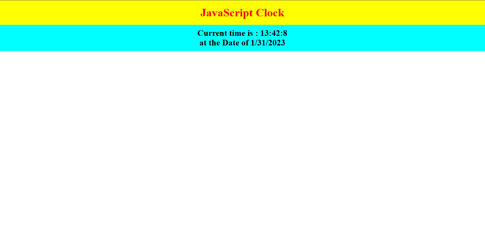

# Simple Clock

<!-- # [Link of deploy live project](https://wirelessheadphonepage.netlify.app/) -->

# What I learned from this project:-

- It is helpful to understand the concept of JavaScript.
- It is helpful to understand align.
- It is good project to clear concept about Date related.

# Howmany time consumed to make this project.

- It take only one hour to complete.